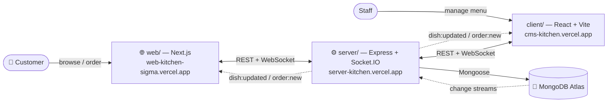
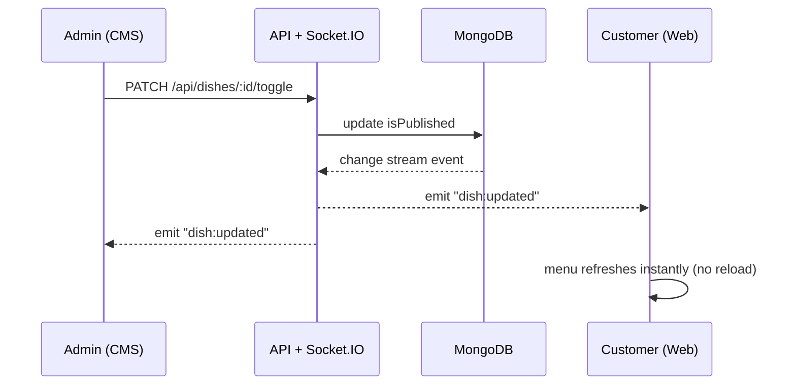
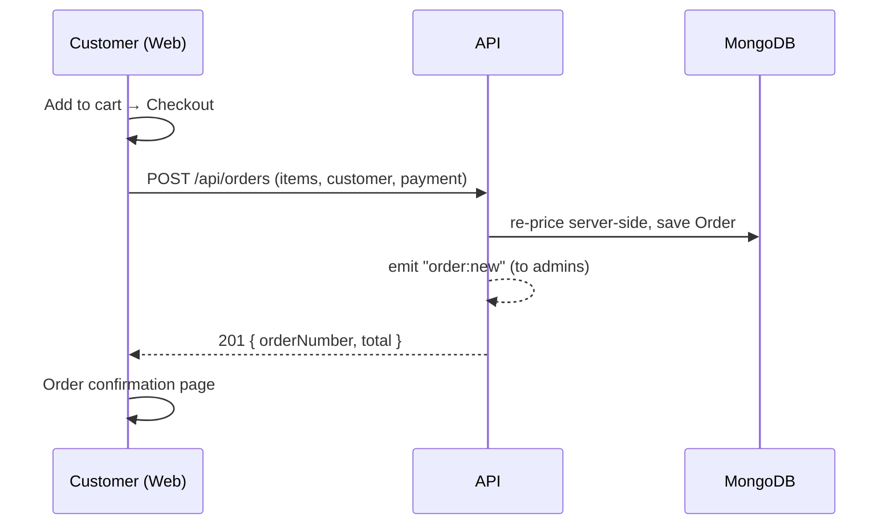

# 🍽️ METNMAT Kitchen — Full-Stack Restaurant System

A real-time restaurant platform in **three apps sharing one database**: a public menu &
ordering website, an admin CMS, and an Express + Socket.IO API.

## 🔗 Live (Vercel)
| App | What it is | URL |
|-----|------------|-----|
| 🌐 **Public menu** (`web/`) | Customer site — menu, cart, checkout, table booking | **https://web-kitchen-sigma.vercel.app** |
| 🛠️ **Admin CMS** (`client/`) | Staff dashboard — publish, add products | **https://cms-kitchen.vercel.app** |
| ⚙️ **API server** (`server/`) | REST + WebSocket backend | **https://server-kitchen.vercel.app** |

> ⚠️ **Production note:** Vercel is **serverless**, so the API's persistent **WebSocket /
> MongoDB change streams don't stay alive** there. For full real-time in production, host
> `server/` on **Render / Railway / Fly.io** and point both frontends at it. On Vercel the
> REST API works but live updates fall back/disconnect. See per-app READMEs.

---

## What it does
- **Customers** browse a 128-dish menu, add to cart, check out (cash or demo card), and book a table.
- **Staff** log into the CMS to publish/unpublish dishes and add new products.
- **Everything is live** — a change in the CMS (or directly in the DB) instantly updates the public menu via WebSockets.

---

## 🧭 Architecture


## 🔄 Real-time sync flow


## 🛒 Order flow

> Diagrams are [Mermaid](https://mermaid.js.org/) — GitHub renders them automatically, no external tool needed.

---

## 📦 The three apps
| Folder | Stack | README |
|--------|-------|--------|
| `server/` | Node, Express, MongoDB, Socket.IO, JWT, Zod, Swagger | [server/README.md](server/README.md) |
| `client/` | React 18, Vite, socket.io-client | [client/README.md](client/README.md) |
| `web/` | Next.js 14 (App Router), socket.io-client | [web/README.md](web/README.md) |

## 🚀 Quick start (local)
Run each in its own terminal (PowerShell-friendly — no `&&`):
```powershell
cd server ; node src\index.js     # API  → http://localhost:4000  (auto-seeds 128 dishes + users)
cd client ; npm run dev            # CMS  → http://localhost:5173
cd web ; npm run dev               # Menu → http://localhost:3000
```
> No MongoDB? Leave `server/.env`'s `MONGODB_URI` empty — the server auto-starts an
> in-memory MongoDB and seeds everything.

### Demo accounts
| Role | Email | Password |
|------|-------|----------|
| admin | `admin@metnmat.com` | `admin123` |
| viewer | `viewer@metnmat.com` | `viewer123` |

## ☁️ Production wiring (Vercel)
After deploying, set these env vars so the apps talk to each other:
- **web-kitchen** → `NEXT_PUBLIC_API_URL` & `NEXT_PUBLIC_SOCKET_URL` = API URL, `NEXT_PUBLIC_SITE_URL` = `https://web-kitchen-sigma.vercel.app`
- **cms-kitchen** → `VITE_API_URL` = API URL
- **server-kitchen** → `MONGODB_URI` (Atlas, allowlist `0.0.0.0/0`), `JWT_SECRET`, and `CLIENT_ORIGIN` = `https://web-kitchen-sigma.vercel.app,https://cms-kitchen.vercel.app`

## 🗂️ Repo structure
```
.
├─ server/   # Express + MongoDB + Socket.IO API (auth, orders, reservations, realtime)
├─ client/   # React + Vite admin CMS (publish, add product)
├─ web/      # Next.js public menu (cart, checkout, booking, SEO)
├─ IDEATION.md
└─ docker-compose.yml
```

## Tech highlights
JWT auth + roles · Zod validation · Swagger docs (`/api/docs`) · MongoDB change streams →
Socket.IO · in-memory DB fallback · Vitest tests · METNMAT dark theme (OKLCH, Space
Grotesk / Inter / JetBrains Mono) · `next/image` + SEO (JSON-LD, sitemap, robots).
